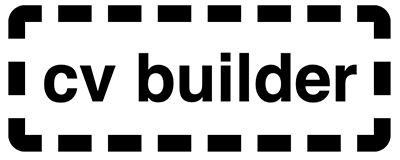
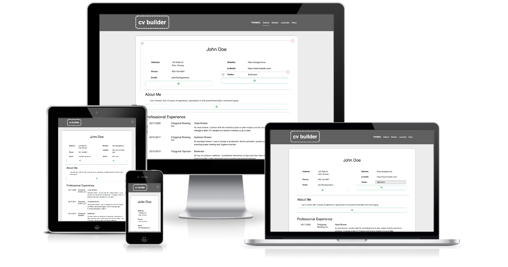
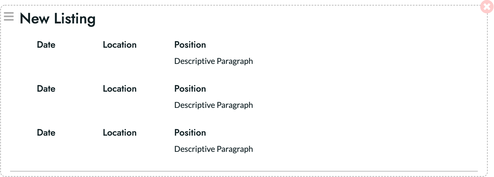

## Table of Contents

-   **[Description](#description)**
-   **[Deployment and Live Demo](#deployment-and-live-demo)**
    -   [Download](#download)
    -   [Clone with Git](#clone-with-git)
    -   [Live Demo](#live-demo)
-   **[UX](#ux)**
    -   [User Stories](#user-stories)
    -   [Wireframes](#wireframes)
    -   [Design](#design)
-   **[Features](#features)**
    -   [CV Sections](#cv-sections)
    -   [Themes](#themes)
    -   [Save Function](#save-function)
    -   [Download as PDF](#download-as-pdf)
    -   [Reset](#reset)
    -   [Responsive Design](#responsive-design)
-   **[Technologies](#technologies)**
-   **[Tools](#tools)**
-   **[Testing](#testing)**
    -   [Manual Testing](#manual-testing)
    -   [User Testing](#user-testing)
    -   [Known Bugs](#known-bugs)
-   **[Scalability](#scalability)**
-   **[Code Notes](#code-notes)**
-   **[Aknowledgments](#aknowledgments)**

---

## Description

CV Builder is meant to be a simple intuitive way for users to create a CV and download it as a PDF file. It gives an array of options to customize a CV's content and its appearance, giving its users the flexibility to create a document that meets their needs.

---

## Deployment and Live Demo

The CV builder can be used locally by cloning or downloading the repository from [github](https://github.com/jumboduck/CV-Builder).

### Download

1. Click on "Clone or download" under the repository name.

2. Click on "Download ZIP"

3. Choose directory to download it to and unzip file

4. Access the CV-builder-master folder

5. Open index.html into your browser to open the CV Builder

### Clone with Git

In your local IDE:

1. Open a new terminal window

2. Change the current working directory to the location where the cloned directory to be created.

3. Enter the following line in the console:

    `git clone https://github.com/jumboduck/CV-Builder.git`

4. Press enter

### Live Demo

The live demo of the cv builder has been deployed to Github Pages and is accessible [here](https://jumboduck.github.io/CV-Builder/index.html).

---

## UX

### User Stories

-   I want to build a CV in a simple way
-   I want to be able to save my cv to a pdf
-   I want to be able to organize the information on my CV
-   I want to be able to save a CV in progress and return to it later
-   I want to be able to reset the content of the CV
-   I want to be able to add and delete sections of my CV
-   I want to choose the look and feel of my CV

These goals are accomplished in the following way:

-   Pre-existing sections to organize information on the CV
-   Intuitive controls to add, delete or sort information
-   Ability to save work in progress to browser's local storage
-   The CV can be downloaded to a PDF file
-   The CV can be reset
-   The CV's appearance can be customized with themes

### Wireframes

Wireframes were created with balsamiq to ensure proper structure and organization of content on all device sizes.
The final version of the wireframes can be found [here](readme-files/CV-Builder-Wireframe.pdf)

### Design

Special care was put into making this cv builder an easy tool to use with intuitive controls and appropriate user feedback. This includes the following:

-   Editable text will blink when hovered
-   Editable text background and outline will change when being edited
-   Clear and colored buttons displayed to add a new element or section, and to delete an element or section
-   Sections and element border change on hover to indicate section or element being accessed
-   Validation message when content has been saved
-   Confirmation popup when content is to be reset
-   Clear handle icon on objects that can be sorted
-   Cursor changes when sortable handle is hovered or grabbed
-   Clear placeholders when sortable element is moved to indicate the new placement to the user

---

## Features

### CV Sections

The information in the user's CV can be displayed in four types of sections.

-   **Info Section** would include the name and two tables of items for various contact information
    
-   **Listing Section** would be used for listings such as education or work experience
    
-   **Block Section** would be used to display simple paragraphs of information
    
-   **Three Column** would be used to list elements in three columns
    

Sections can be added or removed, and re-organized with a drag and drop. This also applies to individual items within these sections.

### Themes

Additionally, the cv can be customized using 4 different themes that change the fonts and colors on the final product:

-   Default
-   Modern
-   Lavender
-   Deco

### Save Function

Any changes made to the cv or its theme can be saved to be updated at a later time.
When saved, the content of the page generates a JSON object which is saved to local storage. The theme chosen by the user is also saved to local storage.
Upon reload of the page, the saved data and theme are automatically displayed on the page. If no information is found in local storage, a default CV will be displayed.

### Download as PDF

The CV builder uses html2pdf.js to convert the content of the CV into a PDF document, that can be downloaded to the user's device.

### Reset

A reset button at the bottom of the page enables the user to reset the CV's content and themes to their default values, and to clear the local storage. The user has to confirm the reset in a modal window before the content is set back to default.

### Responsive Design

This application is primarily meant to be used on computer sized screens but it has been optimized to to work on mobile devices as well.
It was built responsively with the bootstrap framework, and uses JQuery UI Touch Punch to ensure all functionalities work on touch enabled devices.

---

## Technologies

-   HTML
-   CSS
-   Bootstrap
-   Javascript
-   [JQuery](https://jquery.com/)
-   [JQuery UI](https://jqueryui.com/): for effects on the page and the sortable function
-   JQuery UI Touch Punch: to make JQuery UI sortable function touch device friendly
-   [html2pdf.js](https://github.com/eKoopmans/html2pdf.js): relies on HTML2canvas and jsPDF to convert the CV to a PDF file
-   [anchorme.js](https://alexcorvi.github.io/anchorme.js/): dynamically finds urls and email addresses on the CV and converts them to anchor tags

---

## Tools

-   VSCode: IDE used to create and ede code
-   Adobe Photoshop: Image editor used for section vignettes and favicon
-   Balsamiq: Used to create wireframes
-   [Font Awesome](https://fontawesome.com/): used for all icons throughout the site
-   [Google Fonts](https://fonts.google.com/): The following fonts were imported from Google fonts for the various themes: Montserrat, Open Sans, Raleway, Roboto, Lato, Jost
-   [Responsive Viewer](https://chrome.google.com/webstore/detail/responsive-viewer/inmopeiepgfljkpkidclfgbgbmfcennb): Chrome extension used to test site at different screen sizes
-   [Pingdom](https://tools.pingdom.com/): used to test site performance
-   [W3C HTML Validator](https://validator.w3.org/): used to validate HTML code
-   [W3C CSS Validator](https://jigsaw.w3.org/css-validator/): used to validate CSS

---

## Testing

### Manual Testing

The site was tested on various platforms and browsers to ensure proper display and functionality across different screen sizes, including touch devices.

As functionalities were added to the application, thorough testing was conducted to ensure proper behavior with no side-effects.

Google Chrome's dev tools were used extensively for debugging.

The HTML and CSS were validated on W3C Validators, and speed tested on Pingdom.

### User Testing

When the program was advanced enough to be usable, several users were asked to manipulate it to assess their experience and comfort with it. This highlighted the need for more consistent user feedback. The following changes came from this round of testing:

-   Header background color changes when theme changes
-   Placeholders on sortable items to notify user where the item will be positioned
-   Notification when content is saved to local storage, additionally a note was added to let users know the content would be lost if the browser's cache was cleared
-   Confirmation window when content is reset

### Known Bugs

-   When generated from a mobile device, the PDF has a different aspect than when generated from larger screen sized because of how html2pdf.js converts a page to a PDF file. By sending options to html2pdf.js, it is possible for the CV to be laid out as if on a larger screen size, however the page breaks on the PDF seem to be determined by the device's window height, resulting in uneven and unpredictable page breaks. For this reason, the choice was made to have the PDF appear differently when generated from different screen sizes, for now.

---

## Scalability

A number of new features will be implemented in the future.

-   A preview of the final PDF will be seen download

-   More themes and granular customization options, such as a choice of fonts and colors.

-   New types of sections should be available for use

---

## Code Notes

Initially when the CV was saved, the entire inner HTML of printable element was saved as a string. Measures were taken to instead translate the content of the html to an object, which allowed for more flexibility and scalability down the line.

---

## Aknowledgments

[The following Code Institute student project](https://github.com/sabinemm/fruit-game) helped me in creating and structuring this very readme file

Thank you to [Felipe Alarcon](https://github.com/felipe-alarcon) for brainstorming the initial idea for the project, for assistance in testing and for support and guidance along the way.

Many thanks to friends and family who helped testing the program.

Thanks to the CI Slack community for advice in things large and small, and for encouragement throughout the process.
